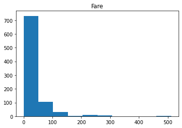
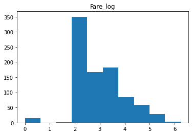
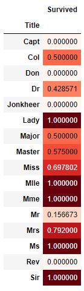
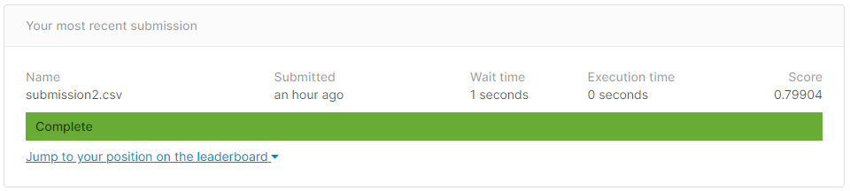
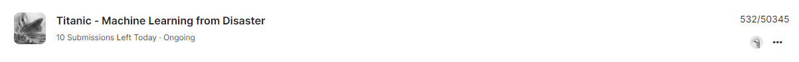

### About

This is the place where I record my projects and notes on Data Science and Machine Learning.  I will be using this page to keep track of my progress.

Data science is generally focused on solving 1 of 3 different problems:

**Supervised Learning:**
-	Classification: Classifying labeled data
-	Regression: Predicting trends using previous labeled data

**Unsupervised Learning:**
-	Clustering: Finding patterns and groupings in unlabeled data

-------------------------

### Project 1 : [Titanic - Machine Learning from Disaster](https://github.com/rx229/Tony_Portfolio/tree/main/Titanic)

*"Use the Titanic passenger data (name, age, price of ticket, etc) to try to predict who will survive and who will die"* - [Kaggle](https://www.kaggle.com/c/titanic)

My first project is a classification problem where I try to predict a binary outcome (whether a passenger on the titanic survives). The project was to build a predictive model that answers the question: “what sorts of people were more likely to survive?” using passenger data.

This was accomplished using Python in a [Jupyter Notebook](https://github.com/rx229/Tony_Portfolio/blob/main/Titanic/Titanic.ipynb). 

**Data Exploration**

I began with some light data exploration using basic commands (.describe(), .info(), value counts) and to understand the nature of the data. There were quite a few null values in the data sets.
I seperated the data into categorical and numerical.
Used histograms for continous numerical data, Fare was very skewed. Normalised Fare with a log function.

Used a correlation matrix to observe correlations between features

**Exploratory Data Analysis**

I broke down several categorical features that had too many variables (Name, Cabin Number and Ticket Number) and tried to extract some meaningful data from the strings. For example I created the Title feature by extracting the title from the Name feature and compared surival rates.

**Data Preprocessing**

I dropped two rows as it has null values in a catergorical feature (Embarked) and imputed missing nurmeric data (Age, Fare) by calculating the mean, Fare by median as the distribution was skewed.
I chose to encode data with OHE over pd.get_dummies as it gave differing number of features between test and training data. I didn't want to manually fix feature lengths. 

**ML Modelling**

I used Random Forest Classifier to produce the final output as it had the highest MAE score compared a few other algorithms.
I used GridSearchCV to tune the parameters of the model and produced a slightly higer MAE score.

My prediction was 79.9% accurate.

Ranked in top 2%

