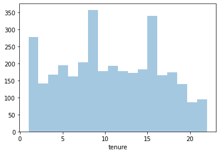
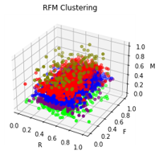
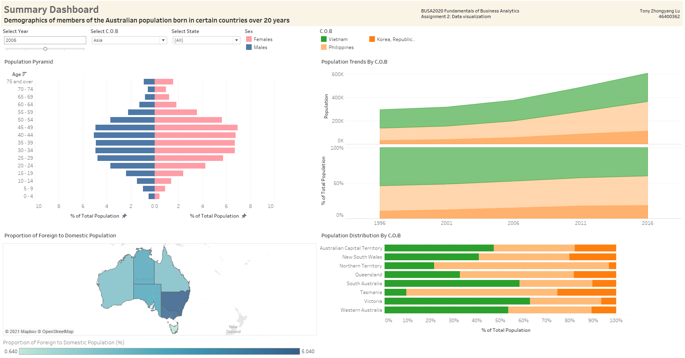

### About

This is the place where I record my projects and notes on Data Science and Machine Learning.  I will be using this page to keep track of my progress.

Data science is generally focused on solving 1 of 3 different problems:

**Supervised Learning:**
-	Classification: Classifying labeled data
-	Regression: Predicting trends using previous labeled data

**Unsupervised Learning:**
-	Clustering: Finding patterns and groupings in unlabeled data

I have also added a section at the bottom for my **Data Visualisation** projects.

-------------------------

### Classification : [Titanic - Machine Learning from Disaster](https://github.com/rx229/Tony_Portfolio/tree/main/Titanic)

*"Use the Titanic passenger data (name, age, price of ticket, etc) to try to predict who will survive and who will die"* - [Kaggle](https://www.kaggle.com/c/titanic)

My first project is a classification problem where I try to predict a binary outcome (whether a passenger on the titanic survives). The project was to build a predictive model that answers the question: “what sorts of people were more likely to survive?” using passenger data.

This was accomplished using Python in a [Jupyter Notebook](https://github.com/rx229/Tony_Portfolio/blob/main/Titanic/Titanic.ipynb). 

**Data Exploration**

I began with some light data exploration using basic commands (.describe(), .info(), value counts) and to understand the nature of the data. There were quite a few null values in the data sets.
I seperated the data into categorical and numerical.
Used histograms for continous numerical data, Fare was very skewed. Normalised Fare with a log function.

**Exploratory Data Analysis**

I broke down several categorical features that had too many variables (Name, Cabin Number and Ticket Number) and tried to extract some meaningful data from the strings. For example I created the Title feature by extracting the title from the Name feature and compared surival rates.

**Data Preprocessing**

I dropped two rows as it has null values in a catergorical feature (Embarked) and imputed missing nurmeric data (Age, Fare) by calculating the mean, Fare by median as the distribution was skewed.
I chose to encode data with OHE over pd.get_dummies as it gave differing number of features between test and training data. I didn't want to manually fix feature lengths. 

**ML Modelling**

I used Random Forest Classifier to produce the final output as it had the highest MAE score compared a few other algorithms.
I used GridSearchCV to tune the parameters of the model and produced a slightly higher MAE score.

My prediction was 79.9% accurate.

Ranked in top 2%

-------------------------

### Clustering Classification : [KPMG Data Analytics Internship - Sprocket Central Pty Ltd](https://github.com/rx229/Tony_Portfolio/tree/main/KPMG%20Virtual%20Internship)

*"Use the Sprocket's data to try to predict which new customers will be the most will valuable"* - [Forage](https://www.theforage.com/virtual-internships/theme/m7W4GMqeT3bh9Nb2c/KPMG-Data-Analytics-Virtual-Internship?ref=xbNanDPJMJmAahRrY)

My second project is the KPMG Data Analytics Internship, where I have decided to apply clustering and classification to predict which customers are the most valuable.

This was accomplished using Python in a [Jupyter Notebook](https://github.com/rx229/Tony_Portfolio/blob/main/KPMG%20Virtual%20Internship/Sprocket%20Central%20Pty%20Ltd%20-%20Predict.ipynb). 

**Data Quality Assessment**

Drafted an [email](https://github.com/rx229/Tony_Portfolio/blob/main/KPMG%20Virtual%20Internship/Sprocket%20Central%20Pty%20Ltd%20-%20Data%20Quality%20Assessment.msg) to the client identifying the data quality issues and strategies to mitigate these issues.

**Introduction**

RFM segmentation is a long-standing marketing analysis method used to quantitatively group customers based on 3 metrics (recency, frequency and monetary), from 

I will be using RFM analysis and machine learning to identify the most valuable customers.

**Data Exploration**

We begin by separating the data set in to training and test sets. CustomerDemographic and CustomerAddress are merged with Transactions details to form the training set and NewCustomerList will be our test set for identifying the most valuable customers

Continuous numerical features with missing values can be imputed. Age and tenure both have a low number of missing values and generally uniform distributions and can be imputed with the means of both features

All customers without transaction details will have to be dropped from the model, as we cannot calculate RFM metrics without them – 508 customers dropped from training set

**Feature Engineering**

I will be engineering the features recency, frequency and monetary for RFM Analysis. All three features will be scaled 0-1 so to compare different variables on equal footing.

Recency will be the mean of the number of days since the customer’s last purchase

Frequency will be the bike related purchases from the customer in the last 3 years

Monetary will the average profit per customer, calculated by the difference of list price and standard cost under Transactions	

I will use k-means clustering to group customers by their RFM metrics. The optimal number of clusters is determined to be 5.

**ML Modelling**

I used Random Forest Classifier to produce the [final output](https://github.com/rx229/Tony_Portfolio/blob/main/KPMG%20Virtual%20Internship/submission.csv)

-------------------------

### Data Visualisation Projects : 

#### [1. Tableau - Demographics of the Australian population](https://github.com/rx229/Tony_Portfolio/blob/main/Data%20Visualisation/Visualisation_of_Australian_Demographic_Data.twbx)

*"Get an understanding of the demographics of members of the Australian population born in certain countries over the past 30 years (1996-2016)."* 

Incoporated both a dashboard and a story board analysing the aging of foreign born populations across 20 years.

